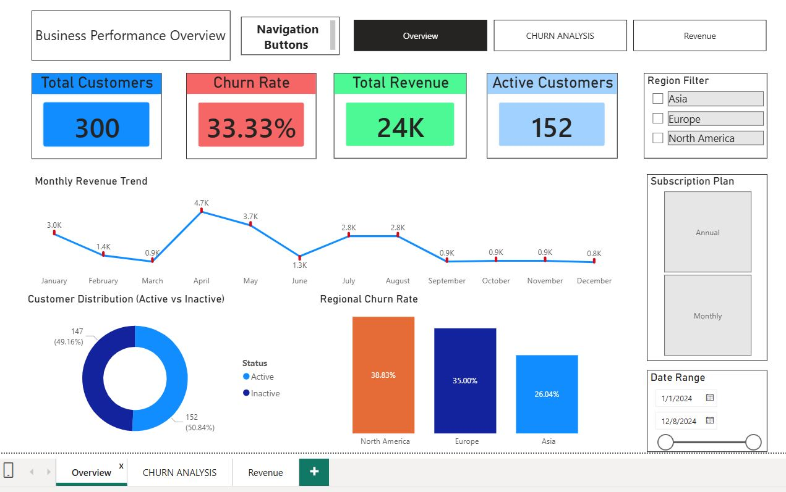
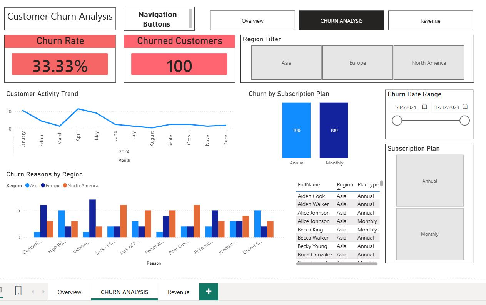
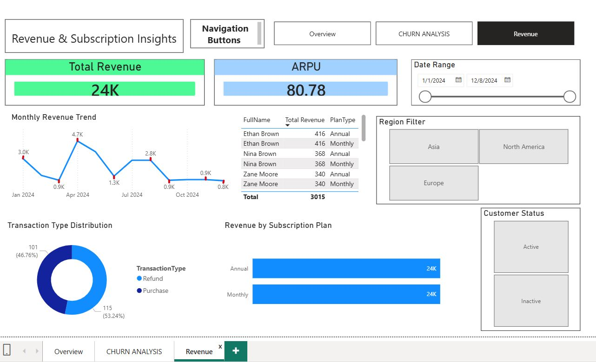

# customer-churn-analysis-dashboard
SQL + Power BI project for customer churn and revenue analysis

An end-to-end **SQL + Power BI analytics project** focused on customer churn, revenue trends, subscription insights, and regional performance analysis.

## 📸 Dashboard Preview

### 1. Overview Dashboard


### 2. Churn Analysis Dashboard


### 3. Revenue Dashboard


This project demonstrates the complete data analytics workflow:

**Raw Data → SQL Cleaning → KPI Analysis → Power BI Dashboard → Business Insights**

---

##  Project Overview

The objective of this project is to analyze customer churn patterns, subscription behavior, and revenue performance across regions.

Using **MySQL for data cleaning and business KPI analysis** and **Power BI for interactive dashboards**, this project helps identify:

* Customer churn rate
* Revenue trends
* Active vs inactive customers
* Regional churn performance
* Subscription plan insights
* ARPU (Average Revenue Per User)

---

## Tools & Technologies

* **MySQL** – Data cleaning, joins, KPI queries 
* **Power BI** – Dashboard design and visualization
* **Excel / CSV** – Raw dataset
* **DAX** – KPI measures and calculated fields

---

## Project Structure

```text
Customer-Churn-Analysis/
│
├── customer_churn_analysis.sql
├── README.md
├── Overview_Dashboard.jpg
├── Churn_Analysis_Dashboard.jpg
├── Revenue_Dashboard.jpg
```

---

## Key Business KPIs

* **Total Customers:** 300
* **Churn Rate:** 33.33%
* **Total Revenue:** 24K
* **Active Customers:** 152
* **ARPU:** 80.78

---

## Dashboard Pages

### 1. Business Performance Overview

Provides a high-level summary of:

* total customers
* churn rate
* active customers
* total revenue
* regional churn comparison
* monthly revenue trend

---

### 2. Churn Analysis

Focuses on churn behavior including:

* churn trend by month
* churn reasons by region
* churn by subscription plan
* customer-level churn details

---

### 3. Revenue & Subscription Insights

Includes:

* monthly revenue trend
* ARPU
* transaction distribution
* revenue by subscription plan
* region-wise revenue analysis

---

##  Key Insights

* Churn rate is significantly high at **33.33%**
* North America shows the highest churn percentage
* Revenue peaked during **April and May**
* Both subscription plans contribute almost equally to revenue
* Inactive customers are nearly equal to active customers, indicating retention risk

---

##  SQL Analysis Covered

The SQL project includes:

* data cleaning
* date conversion
* BOM character fix
* joins
* aggregations
* churn analysis
* revenue analysis
* ARPU calculation
* customer segmentation 

---

## Business Use Case

This dashboard can help businesses:

* improve customer retention strategies
* identify churn reasons
* optimize subscription plans
* track revenue trends
* improve regional performance

---

## Author

**Paras Girdher**
Aspiring **Data Analyst | SQL | Power BI | Python**
